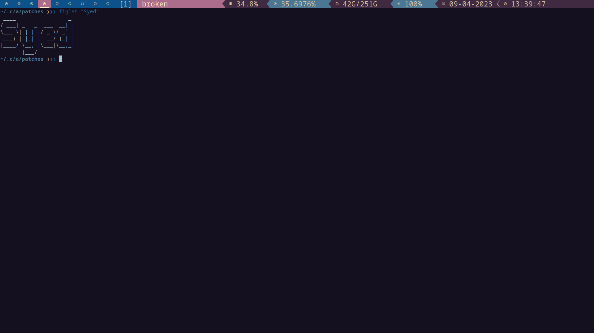

## HashTags's dotfiles

```
 ____        _
|  _ \  ___ | |_ ___
| | | |/ _ \| __/ __|
| |_| | (_) | |_\__ \
|____/ \___/ \__|___/


```

# Programs

* Vim/Nvim - I just use <a href="https://astronvim.comm">AstroNvim </a>

   
  
* Terminal - Alacritty
* Shell - I'm using ZSH as my default shell, <a href="https://zimfw.sh"> Zim </a> as my go-to for my zsh theme, modules and plugins.  
   * Plugins   
      * git
      * zsh-autosuggestion <a href="https://gist.github.com/dogrocker/1efb8fd9427779c827058f873b94df95"> from here </a>
      * zsh-syntax-highlighting  <a href="https://gist.github.com/dogrocker/1efb8fd9427779c827058f873b94df95" > from here </a>
      * python
      * colored-man-pages    
* Font - Iosevka + Powerline


* File Manager - I use ranger as my terminal file manager, it has image preview support with 'Ueberzug'


* Web Browser - I use Brave as my main browser, alongside <a href="https://min.com">Min </a>  
* Emacs - Even though nvim is my main text editor, I do enjoy hacking around with emacs. 
   * Packages
      * ivy   
      * counsel   
      * dashboard   
      * fancy battery   
      * rainbow mode   
      * rainbow-delims
      * doom-themes (using gruvbox)   
      * helpful   
      * which key   
      * neotree   
      * spaceline for modeline   
      * all-the-icons   
      * projectile   
      * evil-mode   


# Window Manager
* DWM - Been using it for 3 years now. 
  * Patches 
    * Alt Tags Decoration    
    * Autostart   
    * Fullgaps    
    * Bar Height    
    * Restart Sig   
    * Status Colors   
    * Swallow   
    * Underline Tags   



* Statusbar - Handmade by yours truky. Find it <a href="https://github.com/AlephaNull/PowerBar-dwm"> here </a>.    
