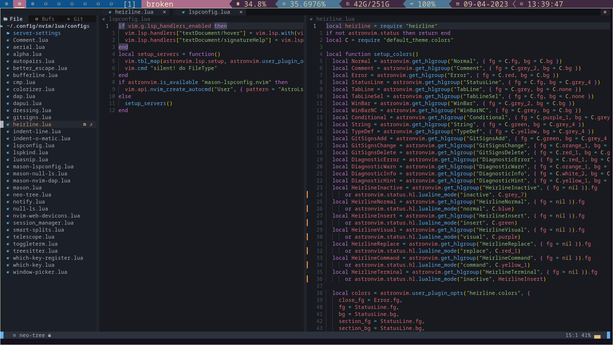
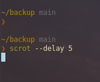
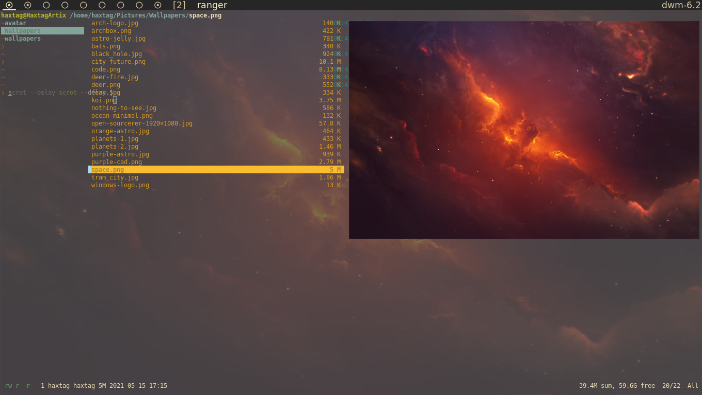
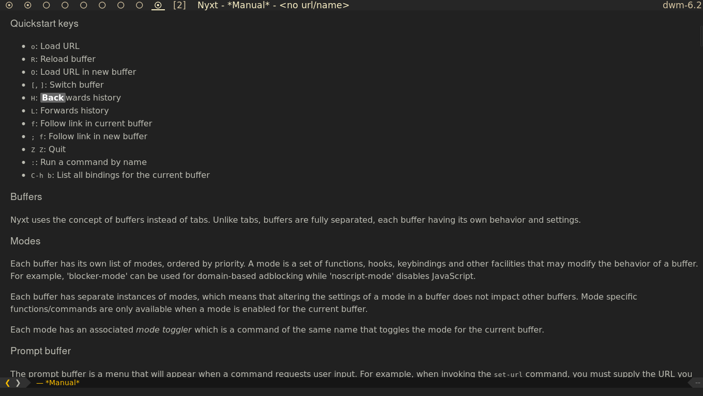
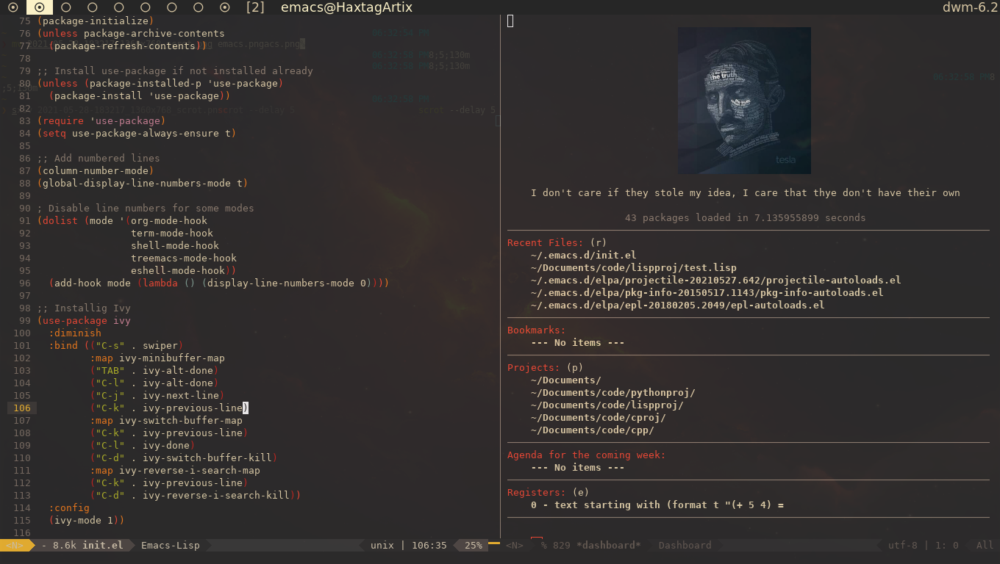

## HashTags's dotfiles

```
 ____        _
|  _ \  ___ | |_ ___
| | | |/ _ \| __/ __|
| |_| | (_) | |_\__ \
|____/ \___/ \__|___/


```

# Programs

* Vim/Nvim - My vim/neovim config for programming with gruvbox theme      
   * Plugins:   
      * vim-fugitive
      * vim-airline/themes
      * dwm.vim 
      * auto-pairs
      * ctrlp.vim
      * vim-rainbow
      * vim-devicons (requires patched powerline font)
      * coc.nvim
      * markdown-preview.nvim
      * vim-hexcolor 
      * vim-autoclose
      * vim-commentary
      * indentline
      * vim-nerdtree
      * supertab
      * vim-minimap
      * vim-autoread
      * vim-slim
      * gruvbox   

   
  
   I used vim-plug to install the plugins

* Shell - I'm using ZSH as my default shell, <a href="https://github.com/ohmyzsh/ohmyzsh"> oh-my-zsh </a> as my plugin manager and <a href="https://github.com/romkatv/powerlevel10k"> Powerlevel10k </a> as the theme   
   * Plugins   
      * git
      * zsh-autosuggestion <a href="https://gist.github.com/dogrocker/1efb8fd9427779c827058f873b94df95"> from here </a>
      * zsh-syntax-highlighting  <a href="https://gist.github.com/dogrocker/1efb8fd9427779c827058f873b94df95" > from here </a>
      * python
      * colored-man-pages    



* File Manager - I use ranger as my terminal file manager, it has image preview support with 'Ueberzug'

* Compositor - I use picom as my compositor. I just use the default config 

* Web Browser - I use qutebrowser as my main browser. It is very cutomizable and written in Python.   

* Emacs - Even though nvim is my main text editor, I do enjoy hacking around with emacs. 
   * Packages
      * ivy   
      * counsel   
      * dashboard   
      * fancy battery   
      * rainbow mode   
      * rainbow-delims
      * doom-themes (using gruvbox)   
      * helpful   
      * which key   
      * neotree   
      * spaceline for modeline   
      * all-the-icons   
      * projectile   
      * evil-mode   


